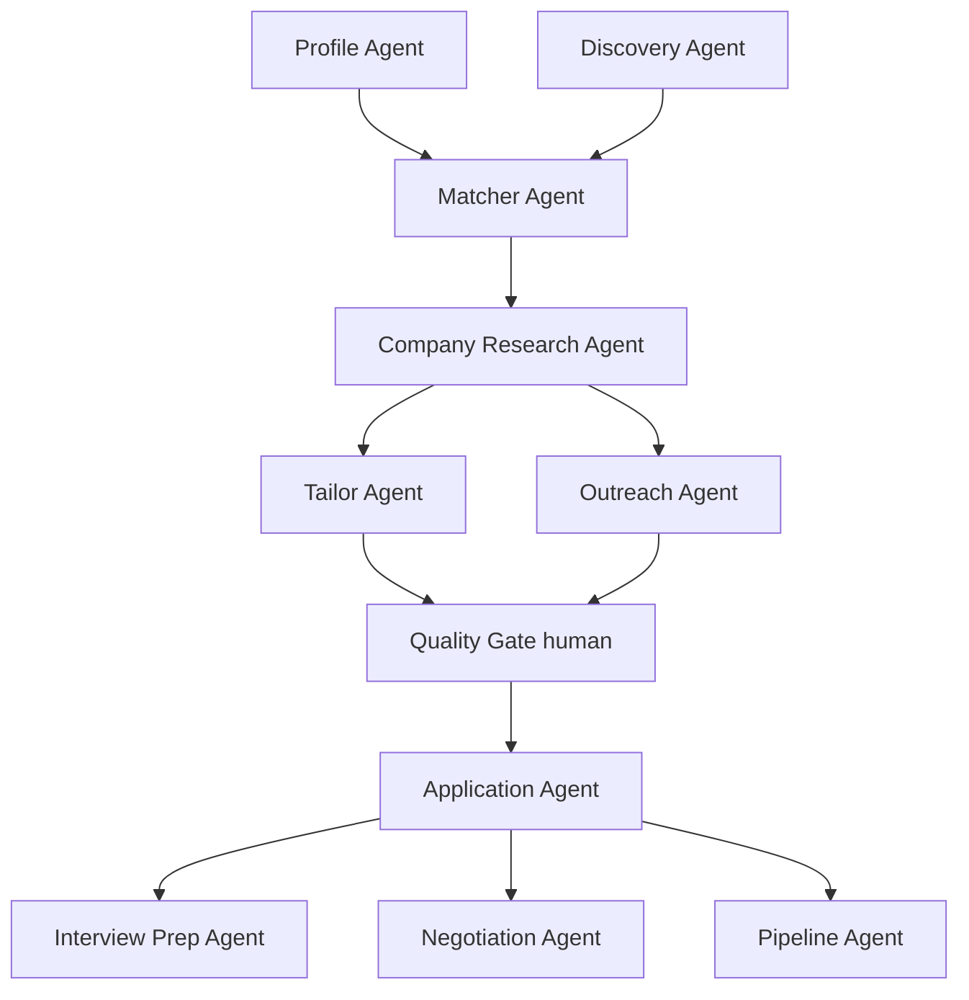

# Pega-en-Chile

> Agentic job-search toolkit tuned for the Chilean market.
> Built with LangGraph. Human-in-the-loop on every outbound action.

`Pega-en-Chile` is an open-source pipeline of cooperating LLM agents that
discover, research, match, tailor and prep for job opportunities — with
deep specialization in the Chilean market (boards, headhunters, comp bands,
CV conventions, Spanish tone, referral pathing).

It is **not** an auto-apply bot. Every outbound message and submission
requires explicit human approval. This is by design: at PM/Director level
the Chilean market is small and relationship-driven, and `quality > volume`.

## Status

🚧 Early scaffolding. The discovery → match loop is the first runnable target.

## Architecture



Each agent is a node in a LangGraph state machine. State is persisted in
SQLite; the UI is a Streamlit shell during MVP.

## Skills

Reusable knowledge packs that encode Chilean-market specialization:

- `chile-market-map` — sectors, top employers, headhunters, VC
- `chile-cv-format` — local CV conventions (RUT, pretensiones de renta, foto)
- `chilean-spanish-tone` — formal vs informal register, regional usage
- `comp-bands-chile` — CLP comp bands, gratificación legal, bono variable
- `network-graph` — warm-network referral pathing
- `interview-pm-latam` — common case + behavioral patterns in CL/Latam

## Quickstart

```powershell
# 1. clone & enter
git clone https://github.com/Luisfe1993/Pega-en-Chile.git
cd Pega-en-Chile

# 2. create venv
python -m venv .venv
.\.venv\Scripts\Activate.ps1

# 3. install
pip install -e ".[dev]"

# 4. copy env template, fill in keys
Copy-Item .env.example .env

# 5. seed your profile from a PDF resume
python -m pega_agent.cli profile-from-pdf "path/to/Resume.pdf"

# 6. run the Streamlit shell
streamlit run app/streamlit_app.py
```

## Roadmap

- [x] Phase 0 — scaffolding, profile schema, SQLite, Streamlit shell
- [x] Phase 1 — Discovery agent (JobSpy + GetOnBoard adapter)
- [x] Phase 2 — Matcher agent (keyword + multilingual semantic embeddings)
- [x] Phase 3 — Company Research agent (DDG + NewsAPI + LLM synthesis)
- [ ] Phase 4 — Tailor + Outreach + real LangGraph `interrupt()` Quality Gate
- [ ] Phase 5 — Interview Prep + Negotiation
- [ ] Phase 6 — Promptfoo eval harness + weekly digest

## Ethics & ToS

- LinkedIn, Indeed and similar boards prohibit scraping in their ToS.
  Use sparingly, throttled, and at your own risk.
- No auto-submission of applications or messages. Ever. The Quality Gate
  is mandatory in the graph and cannot be bypassed.
- The tool does not fabricate experience or credentials when tailoring
  resumes. It reorders, reweights and rephrases existing content only.

## License

MIT — see [LICENSE](LICENSE).
